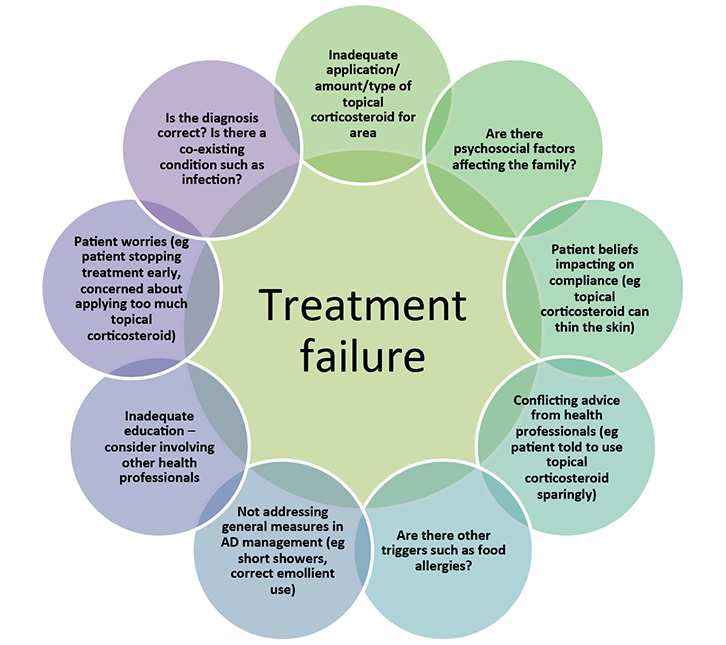

[莎拉·斯特拉西页](https://www.racgp.org.au/afp/authorslist/s/sarah-strathie-page) [斯蒂芬妮·韦斯顿](https://www.racgp.org.au/afp/authorslist/w/stephanie-weston) [理查德·罗](https://www.racgp.org.au/afp/authorslist/l/richard-loh)

[下载文章](https://www.racgp.org.au/getattachment/d8f45af9-0da2-49ff-a1ec-95a8b8846611/Atopic-dermatitis-in-children.aspx)
引用这篇文章   [BIBTEX ](javascript:__doPostBack('p$lt$WebPartZone4$zoneMainContent$pageplaceholder$p$lt$ctl02$ArticleRepeater$repItems$ctl00$ctl00$CitationDownload11$lbDownloadCitation',''))  [REFER ](javascript:__doPostBack('p$lt$WebPartZone4$zoneMainContent$pageplaceholder$p$lt$ctl02$ArticleRepeater$repItems$ctl00$ctl00$CitationDownload12$lbDownloadCitation',''))  [RIS](javascript:__doPostBack('p$lt$WebPartZone4$zoneMainContent$pageplaceholder$p$lt$ctl02$ArticleRepeater$repItems$ctl00$ctl00$CitationDownload13$lbDownloadCitation',''))

------

##### 背景

特应性皮炎是就诊的常见原因。大量儿童受到这种情况的影响，其治疗可能会给父母带来极大的焦虑。全科医生 (GP) 的作用是提供建议并减轻对传统和替代治疗的担忧。

##### 客观的

本文的目的是提供一般实践环境中儿童特应性皮炎管理的概述。本文还回顾了何时需要转诊专家、管理证据以及与过敏的联系。

##### 讨论

为患有特应性皮炎的幼儿开局部类固醇需要对这种情况有透彻的了解。实现治疗依从性部分涉及向父母提供充分的解释，以减少他们对局部皮质类固醇长期副作用的担忧。让全科医生对特应性皮炎充满信心和知识将使从业者、家庭和儿童之间的互动更加有益。

特应性皮炎，也称为特应性湿疹，影响很大比例的儿童，最常见于婴儿，其中 20% 发生在两岁以下的儿童中。[1](https://www.racgp.org.au/afp/2016/may/atopic-dermatitis-in-children#ref-1) – [3](https://www.racgp.org.au/afp/2016/may/atopic-dermatitis-in-children#ref-3)在过去 30 年中，据报道小儿特应性皮炎的发病率增加了两倍至三倍。[2](https://www.racgp.org.au/afp/2016/may/atopic-dermatitis-in-children#ref-2) , [4](https://www.racgp.org.au/afp/2016/may/atopic-dermatitis-in-children#ref-4)大多数儿童在两岁之前患上特应性皮炎。[5](https://www.racgp.org.au/afp/2016/may/atopic-dermatitis-in-children#ref-5)与特应性皮炎相关的显着发病率可以通过早期诊断和治疗来预防。[6](https://www.racgp.org.au/afp/2016/may/atopic-dermatitis-in-children#ref-6)

已经提出了两种主要的理论来解释特应性皮炎——皮肤屏障和免疫学假设。免疫学假设侧重于 T 辅助细胞的不平衡，因此 Th2 细胞而不是 Th1 细胞占优势。这通过涉及白介素激活的途径导致免疫球蛋白 E (IgE) 增加。[7](https://www.racgp.org.au/afp/2016/may/atopic-dermatitis-in-children#ref-7)

在皮肤屏障假说中，特应性皮炎与丝聚蛋白基因突变有关。丝聚蛋白是一种重要的蛋白质，通过将角质形成细胞结合在一起来维持表皮的完整性。如果丝聚蛋白存在缺陷，则会导致皮肤屏障功能障碍，从而导致皮肤水分流失。随着皮肤变得更干燥，过敏原更容易进入，导致过敏。[5、7、8](https://www.racgp.org.au/afp/2016/may/atopic-dermatitis-in-children#ref-5) _ [_](https://www.racgp.org.au/afp/2016/may/atopic-dermatitis-in-children#ref-7) _ [_](https://www.racgp.org.au/afp/2016/may/atopic-dermatitis-in-children#ref-8)

特应性皮炎可以以许多不同的形式出现，因此，鉴别诊断范围很广，可以包括接触性皮炎、脓疱疮、荨麻疹、疥疮、牛皮癣和脂溢性皮炎。[7](https://www.racgp.org.au/afp/2016/may/atopic-dermatitis-in-children#ref-7)在确定特应性皮炎诊断之前考虑这些诊断非常重要。

未经治疗的特应性皮炎的并发症可能包括疱疹性湿疹。疱疹湿疹是一种皮肤病急症，特别是在两岁以下的儿童中，需要紧急转诊到适当的儿科服务部门进行审查和管理。疱疹湿疹可能有严重的后遗症，如眼睛或脑膜受累，导致疤痕。[2](https://www.racgp.org.au/afp/2016/may/atopic-dermatitis-in-children#ref-2) , [9](https://www.racgp.org.au/afp/2016/may/atopic-dermatitis-in-children#ref-9)

### 管理

治疗特应性皮炎的最佳方法是充分了解可用于管理和预防该病的一般和具体措施。与患有特应性皮炎的儿童的父母讨论一下，特应性皮炎一开始是一种慢性病，有一段时间会发作，这是明智的。治疗的目的是完全清除耀斑。

#### 一般措施

一般措施对于预防特应性皮炎和减轻恶化很重要。提出了以下基本原则：[3](https://www.racgp.org.au/afp/2016/may/atopic-dermatitis-in-children#ref-3)

- 避免氯、沙子和草等环境恶化剂，接触后立即清洗
- 穿着宽松的棉质衣服，避免过热
- 进行无皂洗涤
- 短暂淋浴（建议两到三分钟）
- 避免热水淋浴或泡澡；温水是首选。

已发现有效和定期使用润肤剂可减少对局部皮质类固醇的需求。[7](https://www.racgp.org.au/afp/2016/may/atopic-dermatitis-in-children#ref-7)润肤剂通过提供封闭层和减少蒸发来滋润表皮。有效的润肤剂方案是特应性皮炎管理的中流砥柱。

#### 具体措施

具体措施最好分为两个不同的类别——抗炎措施和抗感染措施。治疗湿疹的一线抗炎治疗是外用皮质类固醇。

用于治疗皮肤病的三种最常见的外用皮质类固醇制剂是乳液、乳膏和软膏。重要的是要了解每个人的特点，以便开出最合适的治疗方法。[10](https://www.racgp.org.au/afp/2016/may/atopic-dermatitis-in-children#ref-10)

乳液含有高比例的水和少量的油，并且不像面霜或软膏那样保湿。它们在治疗湿疹方面不太有用，但在提供冷却或干燥效果方面更有益。[10](https://www.racgp.org.au/afp/2016/may/atopic-dermatitis-in-children#ref-10)

面霜主要含有水和油成分。水相容易蒸发，油和药物被皮肤吸收。当水分蒸发时，乳霜会引起特应性皮炎患者的刺痛。如果皮肤不是特别干燥或受刺激，它们很适合保湿。[10](https://www.racgp.org.au/afp/2016/may/atopic-dermatitis-in-children#ref-10)

当皮肤非常干燥时，软膏是最合适的选择。它们可有效维持皮肤屏障和防止脱水。与其他制剂相比，它们的刺激性要小得多，并且更有效地将活性成分输送到皮肤中。软膏主要由油和少量水混合而成。它们最好在皮肤潮湿时使用，例如淋浴或沐浴后。由于油膏油腻、粘稠和凌乱，患者经常被推迟使用，但它们可以非常有效地增加水分并保持良好的皮肤完整性。[10](https://www.racgp.org.au/afp/2016/may/atopic-dermatitis-in-children#ref-10)

|                                                              |
| ------------------------------------------------------------ |
| **轻度（I 类）** 氢化可的松 0.5–1% 醋酸氢化可的松 0.5–1% 地奈德 0.05% |
| **中度（II 类）** 戊酸倍他米松 0.02–0.05% 曲安奈德 0.02% 丁酸氯倍他松 0.05% 甲泼尼龙 0.1% |
| **强（III 类）** 二丙酸贝他米松 0.05% 戊酸倍他米松 0.1% 曲安奈德 0.1% 糠酸莫米松 0.1% |
| **非常强效（IV 类）** 二丙酸倍他米松（软膏） 0.05% Halcinonide 0.1% |

特应性皮炎应使用适当的强度（表 1）、皮质类固醇的用量和配方进行治疗，这将通过考虑儿童的年龄、特应性皮炎的严重程度和所涉及的部位来确定。[9](https://www.racgp.org.au/afp/2016/may/atopic-dermatitis-in-children#ref-9)应避免在面部、颈部、腋窝和腹股沟等脆弱部位使用高效类固醇，一岁以下的儿童应避免使用。[10](https://www.racgp.org.au/afp/2016/may/atopic-dermatitis-in-children#ref-10)应使用外用皮质类固醇，直到皮肤光滑，感觉像正常皮肤，炎症和瘙痒消退。如果在皮肤恢复正常之前停止治疗，它可能会“发作”。指尖装置 (FTU) 是一种有用的工具，可用于教育父母使用足够量的外用皮质类固醇（表 2）。

|                                                              |       |          |          |         |           |
| ------------------------------------------------------------ | ----- | -------- | -------- | ------- | --------- |
| 年龄                                                         | 腿/脚 | 躯干前部 | 躯干背部 | 手臂/手 | 颈部/面部 |
| 3-6 个月                                                     | 1.5   | 1        | 1.5      | 1       | 1         |
| 1-2年                                                        | 2     | 2        | 3        | 1.5     | 1.5       |
| 3-5 年                                                       | 3     | 3        | 3.5      | 2       | 1.5       |
| 6-10 年                                                      | 4.5   | 3.5      | 5        | 2.5     | 2         |
| 指尖单元 (FTU) 可能是确定所需类固醇量的有用方法。它被定义为从适合成人食指到第一折痕的管中挤出的类固醇制剂的量。该表显示了 3 个月至 10 岁儿童所需的 FTU 范围。 |       |          |          |         |           |

抗组胺药对湿疹瘙痒的治疗没有作用。如果睡眠受到严重影响，镇静抗组胺药可能会有所帮助，但瘙痒最好用局部皮质类固醇治疗。[10](https://www.racgp.org.au/afp/2016/may/atopic-dermatitis-in-children#ref-10)

用局部类固醇治疗患有特应性皮炎的儿童时，副作用的风险很小。[7](https://www.racgp.org.au/afp/2016/may/atopic-dermatitis-in-children#ref-7)但是，副作用可能包括妊娠纹、毛细血管扩张和皮肤变薄。一项针对澳大利亚儿童的观察性研究发现，与未使用局部皮质类固醇的年龄匹配对照组相比，研究组的皮肤没有变薄。平均治疗时间为10个月。93% 的患者使用强效外用皮质类固醇，唯一注意到的副作用是轻度毛细血管扩张。[11](https://www.racgp.org.au/afp/2016/may/atopic-dermatitis-in-children#ref-11) 除非专业皮肤科医生或免疫学家建议，否则通常不推荐全身性类固醇。[3](https://www.racgp.org.au/afp/2016/may/atopic-dermatitis-in-children#ref-3)

封闭敷料包括将局部皮质类固醇放置在皮肤上并用湿敷料或干敷料覆盖。尽管几乎没有确切的证据证明其疗效，但该技术已用于治疗特应性皮炎 20 多年。[12](https://www.racgp.org.au/afp/2016/may/atopic-dermatitis-in-children#ref-12) , [13](https://www.racgp.org.au/afp/2016/may/atopic-dermatitis-in-children#ref-13)有许多不同的技术被推荐。我们在家中由患者或家长进行湿敷治疗的做法是在湿的紧身衣服层下使用一层皮质类固醇 15-20 分钟。对于住院治疗，我们使用湿毛巾代替衣服。玛嘉烈医院的住院病人每天接受三次湿敷，然后涂上润肤剂。为方便家人，通常在出院时将其减少为每天一次，直至病情好转，如果特应性皮炎发作，则每晚重新开始。[10](https://www.racgp.org.au/afp/2016/may/atopic-dermatitis-in-children#ref-10) , [14](https://www.racgp.org.au/afp/2016/may/atopic-dermatitis-in-children#ref-14)干燥的封闭敷料通常用于小块增厚的苔藓样湿疹皮肤，这些皮肤对常规应用外用皮质类固醇有抵抗力。建议封闭敷料最多只能使用 7 到 14 天。[12](https://www.racgp.org.au/afp/2016/may/atopic-dermatitis-in-children#ref-12) , [13](https://www.racgp.org.au/afp/2016/may/atopic-dermatitis-in-children#ref-13)

许多患有特应性皮炎的儿童有频繁的感染加重，*金黄色葡萄球菌*是最常见的分离病原体。湿疹严重程度与从拭子中获得的*金黄色葡萄球菌*培养物的密度呈正相关。[15](https://www.racgp.org.au/afp/2016/may/atopic-dermatitis-in-children#ref-15)如果存在广泛感染的特应性皮炎，建议使用短期口服抗生素，但没有证据表明局部或长期使用抗生素有助于预防特应性皮炎。[2](https://www.racgp.org.au/afp/2016/may/atopic-dermatitis-in-children#ref-2)从受影响的皮肤和鼻孔获取拭子可能有助于识别感染和指导进一步的处理。

2009 年，唯一一项安慰剂对照、随机、单盲研究是在使用漂白浴治疗特应性皮炎儿童复发性*金黄色葡萄球菌感染方面进行的。*这涉及 31 名先前感染特应性皮炎的儿童，他们在开始研究前接受两周的口服头孢氨苄后被随机分组。[16](https://www.racgp.org.au/afp/2016/may/atopic-dermatitis-in-children#ref-16) , [17](https://www.racgp.org.au/afp/2016/may/atopic-dermatitis-in-children#ref-17)治疗组每周接受两次漂白浴和莫匹罗星软膏，每天两次，每月连续五天。安慰剂组接受相同频率的白开水浴，并在相同的方案下在鼻子里放凡士林。

总体而言，治疗组受特应性皮炎影响的皮肤的严重程度和体表面积显着降低。对于未浸入浴缸的区域（例如头部和颈部），特应性皮炎的严重程度在组间没有差异。[16](https://www.racgp.org.au/afp/2016/may/atopic-dermatitis-in-children#ref-16) , [17](https://www.racgp.org.au/afp/2016/may/atopic-dermatitis-in-children#ref-17)漂白浴的临床使用方案在表 3 中进行了概述。[16](https://www.racgp.org.au/afp/2016/may/atopic-dermatitis-in-children#ref-16) , [18](https://www.racgp.org.au/afp/2016/may/atopic-dermatitis-in-children#ref-18)每周两次稀释漂白浴对于治疗患有反复感染性特应性皮炎恶化的儿童很有用。如果在鼻拭子中发现葡萄球菌携带，应考虑进行葡萄球菌去定植。[19](https://www.racgp.org.au/afp/2016/may/atopic-dermatitis-in-children#ref-19)

|                                                              |
| ------------------------------------------------------------ |
| 对于漂白浴，您将需要：45 毫升家用漂白剂，4% 次氯酸钠（例如 White King）沐浴油（2-3 瓶装满）40升温水（1/4成人浴缸）毛巾 |
| 脚步：用温水洗个 1/4 水拌入沐浴油在浴缸中加入漂白剂让孩子在浴缸里洗澡长达 10 分钟沐浴时可以轻轻浸湿皮肤上的结痂洗头和脸沐浴后无需冲洗，轻轻拍干，避免摩擦皮肤涂抹润肤霜和处方药膏或软膏如果使用外用类固醇，请在保湿前涂抹 |
| 漂白浴通常建议每周两次                                       |

### 食物过敏

皮肤点刺试验和食物挑战通常只对一线治疗反应不佳的特应性皮炎严重病例有帮助。少数儿童可能会引发食物过敏。这在患有中度或重度湿疹的婴儿和儿童中更为常见。[20](https://www.racgp.org.au/afp/2016/may/atopic-dermatitis-in-children#ref-20) – [22](https://www.racgp.org.au/afp/2016/may/atopic-dermatitis-in-children#ref-22)四分之三的食物引起的特应性皮炎是由牛奶、鸡蛋、大豆、小麦或花生引起的。[22](https://www.racgp.org.au/afp/2016/may/atopic-dermatitis-in-children#ref-22)

禁食饮食只能在医学专家（临床免疫学或过敏专家）的监督下与经认可的执业营养师一起进行，因为可能会出现营养不足。[22](https://www.racgp.org.au/afp/2016/may/atopic-dermatitis-in-children#ref-22)如果孩子有经口挑战证实的食物过敏，排除饮食可能是合适的，但应继续对特应性皮炎进行持续管理。[23](https://www.racgp.org.au/afp/2016/may/atopic-dermatitis-in-children#ref-23)不应劝阻父母自行开始排除饮食。父母怀疑是特应性皮炎诱因和真正的过敏原的食物之间经常存在差异。[22](https://www.racgp.org.au/afp/2016/may/atopic-dermatitis-in-children#ref-22)

### 其他治疗选择

外用钙调神经磷酸酶抑制剂是治疗特应性皮炎的二线药物。它们不具有皮质类固醇的副作用特征；但是，存在免疫抑制的风险。使用吡美莫司的一个常见抱怨是使用时有烧灼感或刺痛感。[24](https://www.racgp.org.au/afp/2016/may/atopic-dermatitis-in-children#ref-24)他克莫司的疗效类似于中等至强效的外用皮质类固醇，吡美莫司的疗效类似于温和的皮质类固醇。[7](https://www.racgp.org.au/afp/2016/may/atopic-dermatitis-in-children#ref-7)在澳大利亚，吡美莫司以乳膏的形式提供，而他克莫司需要复方。对患者而言，外用钙调神经磷酸酶抑制剂的成本明显高于外用皮质类固醇。申请通常每天两次。[24](https://www.racgp.org.au/afp/2016/may/atopic-dermatitis-in-children#ref-24)

光疗是治疗慢性特应性皮炎的有用辅助手段，应在皮肤科医生的指导下进行。它的使用仅限于年龄较大的儿童，因为儿童需要在光疗机中独自站立和无人协助。

对标准治疗无反应的患者可能需要全身免疫抑制。许多全身性药物，如环孢菌素、硫唑嘌呤和甲氨蝶呤，用于治疗严重的特应性皮炎。对一线治疗耐药的特应性皮炎病例可能需要专家意见。[7](https://www.racgp.org.au/afp/2016/may/atopic-dermatitis-in-children#ref-7)

### 结论

虽然常见且通常轻微，但特应性皮炎可能是一种难以处理的疾病（图 1）。我们建议采用逐步方法以及综合措施和具体措施来控制这种情况。

|                              |
| ------------------------------------------------------------ |
| **图 1.**[局部](https://www.racgp.org.au/afp/2016/may/atopic-dermatitis-in-children#ref-6)皮质类固醇治疗失败的常见原因 6、30[解决](https://www.racgp.org.au/afp/2016/may/atopic-dermatitis-in-children#ref-30) 这些因素可能有助于治疗特应性皮炎。如果管理仍然困难，应考虑转诊给皮肤科医生或免疫科医生 |

 

#### 作者

Sarah Strathie Page BSc，MBBS，皮肤科注册主任，玛格丽特公主医院，珀斯，WA。sarah.strathiepage@health.wa.gov.au

Stephanie Weston MBBS，FRACP，FACD，皮肤科医生顾问，玛格丽特公主医院，珀斯，WA

Richard Loh MBBS, FRACP, FAAAAI, FACAAI, 顾问免疫学家, 玛格丽特公主医院, 珀斯, WA

**竞争利益：无。
出处和同行评审：未委托，外部同行评审。**

------

##### 参考

1. Spergel JM，帕勒 AS。特应性皮炎和特应性进行曲。J Allergy Clin Immunol 2003；112（6 增刊）：S118-27。[搜索 PubMed](http://www.ncbi.nlm.nih.gov/pubmed?term=Spergel JM, Paller AS. Atopic dermatitis and the atopic march. J Allergy Clin Immunol 2003;112(6 Suppl):S118–27.)
2. Boguniewicz M，梁迪。最近对特应性皮炎的见解及其对感染性并发症管理的意义。J Allergy Clin Immunol 2010；125(1):4-13；测验 14-5。[搜索 PubMed](http://www.ncbi.nlm.nih.gov/pubmed?term=Boguniewicz M, Leung DY. Recent insights into atopic dermatitis and implications for management of infectious complications. J Allergy Clin Immunol 2010;125(1):4–13; quiz 14–5.)
3. 澳大利亚临床免疫学和过敏学会。湿疹（特应性皮炎）。新南威尔士州巴尔戈拉：ASCIA，2013 年。可在 www.allergy.org.au/health-professionals/hp-information/asthma-and-allergy/atopic-dermatitis [2015 年 1 月 1 日访问]。[搜索 PubMed](http://www.ncbi.nlm.nih.gov/pubmed?term=Australasian Society of Clinical Immunology and Allergy. Eczema (atopic dermatitis). Balgowlah, NSW: ASCIA, 2013. Available at www.allergy.org.au/health-professionals/hp-information/asthma-and-allergy/atopic-dermatitis [Accessed 1 January 2015].)
4. 买LM。特应性皮炎的治疗选择。Am Fam Physician 2007；75(4):523–28。[搜索 PubMed](http://www.ncbi.nlm.nih.gov/pubmed?term=Buys LM. Treatment options for atopic dermatitis. Am Fam Physician 2007;75(4):523–28.)
5. 沃尔夫 K，约翰逊 RA。特应性皮炎：Fitzpatrick 的彩色图谱和临床皮肤病学概要。第 6 版。纽约：McGraw-Hill Medical，2009 年。[搜索 PubMed](http://www.ncbi.nlm.nih.gov/pubmed?term=Wolff K, Johnson RA. Atopic dermatitis: Fitzpatrick’s color atlas and synopsis of clinical dermatology. 6th edn. New York: McGraw-Hill Medical, 2009.)
6. Lewis-Jones S. 生活质量和儿童特应性皮炎：患有儿童湿疹的痛苦。国际临床实践杂志 2006；60(8):984–92。[搜索 PubMed](http://www.ncbi.nlm.nih.gov/pubmed?term=Lewis-Jones S. Quality of life and childhood atopic dermatitis: The misery of living with childhood eczema. Int J Clin Pract 2006;60(8):984–92.)
7. 汤姆森SF。特应性皮炎：自然史、诊断和治疗。ISRN 过敏 2014。doi：10.1155/2014/354250。[搜索 PubMed](http://www.ncbi.nlm.nih.gov/pubmed?term=Thomsen SF. Atopic dermatitis: Natural history, diagnosis, and treatment. ISRN Allergy 2014. doi: 10.1155/2014/354250.)
8. Maintz L, Novak N. 越来越复杂：特应性湿疹的病理生理学。Eur J Dermatol 2007；17(4):267–83。[搜索 PubMed](http://www.ncbi.nlm.nih.gov/pubmed?term=Maintz L, Novak N. Getting more and more complex: The pathophysiology of atopic eczema. Eur J Dermatol 2007;17(4):267–83.)
9. Dempster J、Jani B、Daly T. 管理儿童湿疹——治疗更新。J Fam 实践 2011；60(11):660–68。[搜索 PubMed](http://www.ncbi.nlm.nih.gov/pubmed?term=Dempster J, Jani B, Daly T. Managing eczema in children – A treatment update. J Fam Pract 2011;60(11):660–68.)
10. McKoy K. 治疗皮肤病。默克手册。新泽西州凯尼尔沃思：Merck Sharp & Dohme Corporation，2015 年。可访问 www.merckmanuals.com/home/skin_disorders/treatment_of_skin_disorders/treatment_of_skin_disorders.html [2014 年 1 月 3 日访问]。[搜索 PubMed](http://www.ncbi.nlm.nih.gov/pubmed?term=McKoy K. Treatment of skin disorders. Merck manual. Kenilworth, NJ: Merck Sharp & Dohme Corporation, 2015. Available at www.merckmanuals.com/home/skin_disorders/treatment_of_skin_disorders/treatment_of_skin_disorders.html [Accessed 3 January 2014].)
11. Hong E、Smith S、Fischer G. 评估小儿皮肤病患者局部皮质类固醇的致萎缩潜力。儿科皮肤病 2011；28(4):393–96。[搜索 PubMed](http://www.ncbi.nlm.nih.gov/pubmed?term=Hong E, Smith S, Fischer G. Evaluation of the atrophogenic potential of topical corticosteroids in pediatric dermatology patients. Pediatr Dermatol 2011;28(4):393–96.)
12. 德维勒斯 AC，奥兰治美联社。“湿敷”敷料作为儿童严重和/或难治性特应性皮炎干预治疗的有效性和安全性：文献综述。Br J Dermatol 2006；154(4):579–85。[搜索 PubMed](http://www.ncbi.nlm.nih.gov/pubmed?term=Devillers AC, Oranje AP. Efficacy and safety of ‘wet-wrap’ dressings as an intervention treatment in children with severe and/or refractory atopic dermatitis: A critical review of the literature. Br J Dermatol 2006;154(4):579–85.)
13. Braham SJ、Pugashetti R、Koo J 等人。特应性皮炎的封闭疗法：概述。皮肤病学杂志 2010；21(2):62-72。[搜索 PubMed](http://www.ncbi.nlm.nih.gov/pubmed?term=Braham SJ, Pugashetti R, Koo J, et al. Occlusive therapy in atopic dermatitis: Overview. J Dermatolog Treat 2010;21(2):62–72.)
14. 澳大利亚临床免疫学和过敏学会。湿疹的行动计划。新南威尔士州巴尔戈拉：ASCIA，2014 年。可查阅 www.allergy.org.au/images/pcc/Eczema_Action_Plan_2014.pdf [2015 年 2 月 19 日访问]。[搜索 PubMed](http://www.ncbi.nlm.nih.gov/pubmed?term=Australasian Society of Clinical Immunology and Allergy. Action plan for eczema. Balgowlah, NSW: ASCIA, 2014. Available at www.allergy.org.au/images/pcc/Eczema_Action_Plan_2014.pdf [Accessed 19 February 2015].)
15. Hill SE, Yung A, Rademaker M. 金黄色葡萄球菌的患病率和特应性皮炎儿童的抗生素耐药性：新西兰的经验。澳大利亚皮肤病杂志 2011；52(1):27-31。[搜索 PubMed](http://www.ncbi.nlm.nih.gov/pubmed?term=Hill SE, Yung A, Rademaker M. Prevalence of Staphylococcus aureus and antibiotic resistance in children with atopic dermatitis: A New Zealand experience. Australas J Dermatol 2011;52(1):27–31.)
16. Huang JT、Abrams M、Tlougan B 等。治疗特应性皮炎中的金黄色葡萄球菌定植可降低疾病严重程度。儿科 2009；123(5):e808-14。[搜索 PubMed](http://www.ncbi.nlm.nih.gov/pubmed?term=Huang JT, Abrams M, Tlougan B, et al. Treatment of Staphylococcus aureus colonization in atopic dermatitis decreases disease severity. Pediatrics 2009;123(5):e808–14.)
17. Huang JT, Rademaker A, Paller AS。为特应性皮炎中的金黄色葡萄球菌定植稀释漂白浴，以降低疾病的严重程度。Arch Dermatol 2011；147(2):246-47。[搜索 PubMed](http://www.ncbi.nlm.nih.gov/pubmed?term=Huang JT, Rademaker A, Paller AS. Dilute bleach baths for Staphylococcus aureus colonization in atopic dermatitis to decrease disease severity. Arch Dermatol 2011;147(2):246–47.)
18. Krakowski AC，Eichenfield LF，Dohil MA。儿科人群特应性皮炎的管理。儿科 2008；122(4):812-24。[搜索 PubMed](http://www.ncbi.nlm.nih.gov/pubmed?term=Krakowski AC, Eichenfield LF, Dohil MA. Management of atopic dermatitis in the pediatric population. Pediatrics 2008;122(4):812–24.)
19. 治疗指南。复发性葡萄球菌皮肤感染。在：eTG 完成 [Internet]。墨尔本：治疗指南有限公司，2015 年。[搜索 PubMed](http://www.ncbi.nlm.nih.gov/pubmed?term=Therapeutic Guidelines. Recurrent staphylococcal skin infection. In: eTG complete [Internet]. Melbourne: Therapeutic Guidelines Limited, 2015.)
20. Ellis C、Luger T、Abeck D 等人。特应性皮炎 II (ICCAD II) 国际共识会议：临床更新和当前治疗策略。Br J Dermatol 2003；148 增刊 63：3-10。[搜索 PubMed](http://www.ncbi.nlm.nih.gov/pubmed?term=Ellis C, Luger T, Abeck D, et al. International Consensus Conference on Atopic Dermatitis II (ICCAD II): Clinical update and current treatment strategies. Br J Dermatol 2003;148 Suppl 63:3–10.)
21. Eller E、Kjaer HF、Host A 等人。儿童早期食物过敏和食物致敏：来自 DARC 队列的结果。过敏 2009；64(7):1023–29。[搜索 PubMed](http://www.ncbi.nlm.nih.gov/pubmed?term=Eller E, Kjaer HF, Host A, et al. Food allergy and food sensitization in early childhood: Results from the DARC cohort. Allergy 2009;64(7):1023–29.)
22. Greenhawt M.食物过敏在特应性皮炎中的作用。过敏性哮喘过程 2010；31(5):392–97。[搜索 PubMed](http://www.ncbi.nlm.nih.gov/pubmed?term=Greenhawt M. The role of food allergy in atopic dermatitis. Allergy Asthma Proc 2010;31(5):392–97.)
23. Bronsnick T，Murzaku EC，Rao BK。皮肤病学饮食：第一部分。特应性皮炎、痤疮和非黑色素瘤皮肤癌。J Am Acad Dermatol 2014；71(6):1039.e1–e12。[搜索 PubMed](http://www.ncbi.nlm.nih.gov/pubmed?term=Bronsnick T, Murzaku EC, Rao BK. Diet in dermatology: Part I. Atopic dermatitis, acne, and nonmelanoma skin cancer. J Am Acad Dermatol 2014;71(6):1039.e1–e12.)
24. 澳大利亚处方。吡美莫司。Aust Prescr 2003；26:146-51。[搜索 PubMed](http://www.ncbi.nlm.nih.gov/pubmed?term=Australian Prescriber. Pimecrolimus. Aust Prescr 2003;26:146–51.)
25. Carlos G、Uribe P、Fernández-Peñas P. 合理使用外用皮质类固醇。Aust Prescr 2013；36:158-61。[搜索 PubMed](http://www.ncbi.nlm.nih.gov/pubmed?term=Carlos G, Uribe P, Fernández-Peñas P. Rational use of topical corticosteroids. Aust Prescr 2013;36:158–61.)
26. 治疗指南。皮质类固醇：用于皮肤科。在：eTG 完成 [Internet]。墨尔本：治疗指南有限公司，2015 年。[搜索 PubMed](http://www.ncbi.nlm.nih.gov/pubmed?term=Therapeutic Guidelines. Corticosteroids: Use in dermatology. In: eTG complete [Internet]. Melbourne: Therapeutic Guidelines Limited, 2015.)
27. 皮肤科 - 儿童和青少年健康服务。健康事实：为患有特应性皮炎（湿疹）的儿童提供稀释的漂白浴。华盛顿州苏比亚科：CAHS，2014 年。可查阅 www.pmh.health.wa.gov.au/health/docs/CAHS833.pdf [2015 年 2 月 5 日访问]。[搜索 PubMed](http://www.ncbi.nlm.nih.gov/pubmed?term=Department of Dermatology – Child and Adolescent Health Service. Health facts: Diluted bleach baths for children with atopic dermatitis (eczema). Subiaco, WA: CAHS, 2014. Available at www.pmh.health.wa.gov.au/health/docs/CAHS833.pdf [Accessed 5 February 2015].)
28. 皮肤科 - 儿童和青少年健康服务。照顾孩子的湿疹。华盛顿州苏比亚科：CAHS，2014 年。可查阅 www.pmh.health.wa.gov.au/health/docs/CAHS873.pdf [2015 年 2 月 5 日访问]。[搜索 PubMed](http://www.ncbi.nlm.nih.gov/pubmed?term=Department of Dermatology – Child and Adolescent Health Service. Caring for your child’s eczema. Subiaco, WA: CAHS, 2014. Available at www.pmh.health.wa.gov.au/health/docs/CAHS873.pdf [Accessed 5 February 2015].)
29. Mooney E、Rademaker M、Dailey R 等人。小儿湿疹局部皮质类固醇的副作用：澳大利亚共识声明。Australas J Dermatol 2015 [印刷前电子版]。[搜索 PubMed](http://www.ncbi.nlm.nih.gov/pubmed?term=Mooney E, Rademaker M, Dailey R, et al. Adverse effects of topical corticosteroids in paediatric eczema: Australasian consensus statement. Australas J Dermatol 2015 [Epub ahead of print].)
30. Moret L、Anthoine E、Aubert-Wastiaux H 等人。TOPICOP(c)：一种评估特应性皮炎门诊患者及其父母的局部皮质类固醇恐惧症的新量表。公共科学图书馆一号 2013；8(10):e76493。[搜索 PubMed](http://www.ncbi.nlm.nih.gov/pubmed?term=Moret L, Anthoine E, Aubert-Wastiaux H, et al. TOPICOP(c): A new scale evaluating topical corticosteroid phobia among atopic dermatitis outpatients and their parents. PLoS One 2013;8(10):e76493.)